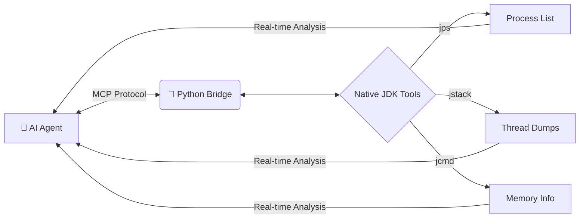

# 🚀 JVM-MCP-Bridge

> **Giving AI Agents "Eyes" into the Java Virtual Machine.**

[](https://modelcontextprotocol.io)
[](https://www.oracle.com/java/)
[](https://www.python.org/)

---

### 🧠 The Problem
AI Agents (like Claude or GitHub Copilot) are expert coders but **blind** to runtime behavior. When your Java app hangs or crashes, you have to manually copy-paste logs, stack traces, and stats. It's slow, manual, and error-prone.

### ⚡ The Solution
A lightweight **Multi-Agent Communication Protocol (MCP)** server that wraps native JDK tools. It allows AI agents to "log in" to your machine, run diagnostics, and find bugs like deadlocks or memory leaks **automatically**.

---

## 🛠️ Visual Architecture



##✨ Key Features

* 🚫 No Third-Party Tools: No need for Arthas or VisualVM. If you have a JDK, you're ready.
* 🕵️ Process Discovery: AI can automatically find which Java apps are running.
* 🧵 Deadlock Detection: AI identifies exactly which line of code is causing a thread hang.
* 📉 Memory Health: Real-time heap analysis to catch memory leaks early.
* 🪶 Ultra-Lightweight: Only runs when called. Zero impact on application performance.

 *File Directory Structure:
---
```
 jvm-mcp-bridge/
├── 🐍 src/                      # The Python Bridge (The "Brain")
│   ├── __init__.py
│   ├── server.py               # MCP Server: Exposes tools to the AI
│   └── jvm_utils.py            # Command Logic: Executes jstack, jps, etc.
│
├── ☕ test_folder/              # The Diagnostic Lab (The "Patient")
│   ├── JVMTestLab.java         # Test app with leaks and deadlocks
│   └── JVMTestLab.class        # Compiled bytecode
│
├── ⚙️ Configuration
│   ├── mcp.json                # VS Code / Copilot connection settings
│   └── claude_desktop_config   # Claude Desktop connection settings
│
├── 📦 Dependencies
│   ├── .venv/                  # Python Virtual Environment
│   └── requirements.txt        # FastMCP and MCP SDK
│
└── 📜 README.md                # Project documentation & setup guide
```
---

## 🛠️ Tech Stack

| Category | Technology | Role |
| :--- | :--- | :--- |
| **AI Protocol** | [MCP](https://modelcontextprotocol.io/) | Universal standard enabling AI agents to connect with local tools. |
| **Logic Layer** | [Python 3.10+](https://www.python.org/) | Core "glue" language used to build the diagnostic server. |
| **AI Framework** | [FastMCP](https://github.com/modelcontextprotocol/python-sdk) | High-level SDK used to transform Python functions into AI tools. |
| **JVM Diagnostics** | **Native JDK Binaries** | Leverages `jps`, `jstack`, and `jcmd` for zero-dependency monitoring. |
| **System Bridge** | **Subprocess** | Executes OS-level shell commands to interact with the Java runtime. |
| **AI Hosts** | **Claude / VS Code** | The environment (Copilot/Cline) where the AI utilizes the server. |
| **Target App** | **Java (JVM)** | The platform being monitored; supports any app running on the JVM. |

🚀 Quick Start
1. Prerequisites
```
Python 3.10+
JDK (Installed and in your system PATH)
```
3. Setup
```
# Clone the repo
git clone https://github.com/your-username/jvm-mcp-bridge.git
cd jvm-mcp-bridge
```
# Create virtual environment
```
python -m venv .venv
source .venv/bin/activate  # Windows: .venv\Scripts\activate
```

# Install dependencies
```
pip install "mcp[cli]" fastmcp
```
3. Link to AI Agent (VS Code / Claude)
Add this to your MCP configuration file:
```
JSON
"jvm-monitor": {
  "command": "python",
  "args": ["/absolute/path/to/src/server.py"],
  "env": {
    "PATH": "/your/jdk/bin/path;..."
  }
}
```
🧪 Testing the "Lab"

* We included a JVMTestLab.java that simulates real-world failures. Try asking your AI:
* "@jvm-monitor Check my JVMTestLab app. Why is it stuck?"
* The AI will respond with:
* "I've analyzed the thread dump. Deadlock-Thread-1 is waiting for a lock held by Deadlock-Thread-2 at JVMTestLab:45. Here is the fix..."

📊 Comparison

* Feature	: Arthas / VisualVM	JVM-MCP-Bridge
* User	  : Human Expert	AI Agent + Human
* Weight	: Heavy (Java Agent)	Zero (Native Tools)
* Setup	  : Complex	Instant
* Analysis:	Manual	Automated by AI

🤝 Contributing

Feel free to open issues or PRs! Let's build the future of Autonomous Debugging.
<p align="center">
Made with ❤️ for the Java Ecosystem
</p>
```
